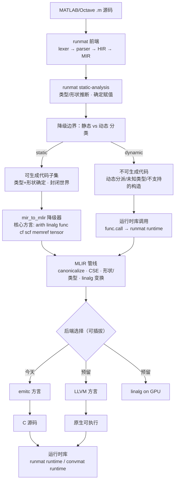

# convmat 架构（长期文档）

> 本文档是 convmat 的权威架构说明，Zed Agent 会在每次会话自动读取。
> 做任何涉及前端/后端/方言/代码生成的改动前，先对照本文，避免偏离既定设计。

## 1. 目标与非目标

**目标**：成为「更好的 MATLAB Coder」——把 MATLAB/Octave 源码编译成可部署的
本地代码，优先是 C，同时为其他后端预留清晰接口。

**非目标（至少当前阶段）**：

- 不追求 100% 覆盖 MATLAB 语言；允许一个「可生成代码子集」+ 运行时兜底。
- 不重复实现词法/语法解析、类型/形状推断、名字解析等前端工作（复用 runmat）。
- 不重复造 MLIR 的优化/验证/后端轮子（复用 melior + 上游 MLIR passes）。

## 2. 核心决策一览

| 问题 | 决策 |
|------|------|
| 从哪一层进入 MLIR | **MIR → MLIR**（不是 AST，也不是 HIR） |
| 可/不可生成代码的边界 | 静态分析后按「类型/形状是否确定 + 是否封闭世界」做函数级/表达式级分类 |
| 代码生成后端 | 今天 `emitc` 方言 → C；后端做成可插拔策略，预留 LLVM/GPU 等 |
| 函数 ABI（跨函数传值） | 能由 C 直接表示的值走返回值；数组/可变长等走**输出指针入参**，空间由调用方分配 |
| 是否自定义方言 | **暂不自定义**；先只用核心方言，动态语义走运行时库调用 |
| 复用原则 | 能用 MLIR 的（passes、验证、后端）就不自研 |

## 3. 决策一：从 MIR 降级到 MLIR（而非 AST）

选择 **MIR → MLIR**，理由：

1. **语义鸿沟最小**。MLIR 是静态类型、SSA、值语义的底层 IR；MATLAB AST 是动态
   类型、隐式广播、矩阵优先、重载操作符的高层表示，二者距离太大。直接从 AST 降级，
   等于要在 convmat 里重写一遍「类型推断 + 形状推断 + 名字解析 + 控制流归一化 +
   确定赋值分析」这套 runmat 已经实现且仍在维护的机器。
2. **复用而非重造**。runmat 前端管线是 `lexer → parser → HIR → MIR`，并在执行前跑
   `runmat-static-analysis`（类型/形状推断、确定赋值）。MIR 是这套管线里**已经把
   动态语义解决得最接近底层**的一层——控制流显式、操作符已脱糖、类型/形状信息可携带。
   在 MIR 处接入，等于白捡了整个前端。
3. **AST 作为备选不划算**。虽然 AST 不依赖 runmat 的 MIR 内部表示，能获得「完全掌控」，
   但代价是维护一整条重复的前端 + 降级链，长期成本远高于收益。

> 结论：**runmat 前端（lexer/parser/HIR/MIR + static-analysis）是 convmat 的第 0 层，
> MIR 是 convmat 的输入边界**。convmat 自己的起点是「MIR → MLIR 降级器」。

对应 crates（均已发布到 crates.io，0.6.2）：

- `runmat-parser`、`runmat-hir`、`runmat-mir`、`runmat-static-analysis`

> 注意：runmat 目前是 pre-1.0，MIR 语义仍在演化。降级器应集中在一处（见第 8 节
> `mir_to_mlir` 模块），把对 MIR 结构的依赖隔离起来，便于跟随 runmat 版本升级。

## 4. 决策二：可生成代码 / 不可生成代码的边界

MATLAB 是动态语言，无法（也不应）要求所有代码都静态可编译。边界由**静态分析结果**
决定，且是**函数级 + 表达式级**的，而不是「要么全编译、要么全解释」。

**判定规则**：一个函数（或子表达式）「可生成代码」当且仅当同时满足：

1. **类型确定**：所有变量的元素类型被推断为具体类型（`double` / `single` / `int32` /
   `logical` 等），而非动态 `Value` 盒。
2. **形状可控**：需要静态形状的地方（例如进入 `memref`/`tensor` 的数组）形状已推断；
   形状运行期才确定的，降级为运行时库调用。
3. **封闭世界**：被调用的函数要么同样可生成代码，要么被声明为外部符号（映射到运行时
   C 函数）。
4. **不含不支持的构造**：如 `eval`/`evalin`、字符串形式的 `feval`、`assignin`、动态
   字段/元胞索引、变长 `varargin`/`varargout`、`classdef` 动态分派、类型未知的
   `global` 等。

**边界两侧的处理**：

- **边界内（可生成代码）**：MIR 节点 → 核心 MLIR 方言（`arith`/`linalg`/`func`/
  `cf`/`scf`/`memref`/`tensor`）→ `emitc` → C。
- **边界外（不可生成代码）**：不报错中止，而是**降级为运行时库调用**
  （`func.call` 到 runmat runtime / convmat runtime 的 C 符号），把该表达式/函数交给
  运行时解释执行。这样生成的 C 是「静态编译代码 + 少量运行时回退调用」的混合体。

> 这与 MATLAB Coder 的「code generation readiness + `coder.extrinsic`」思路一致，
> 但边界由 convmat 自己的静态分析统一判定，而不是要求用户手工标注。

## 5. 决策三：代码生成后端（今天 C，预留其他）

后端做成**可插拔策略**，输入都是同一个「已降到核心方言」的 MLIR module：

- **今天**：`emitc` 方言 → C 源码（`emitc-translate --mlir-to-cpp` 风格）。这是标准
  MLIR 能力，不必自写 C 发射器。
- **预留**：同一 module 可换 LLVM 后端（→ 原生可执行）、`linalg` on GPU（→ 异构加速）、
  WASM 等。换后端只改「后端选择」这一层，不动前端和降级器。

**函数 ABI**：生成的 C 函数遵循「C 能直接表示的值走返回值，不能的走输出指针」的统一约定：

- 标量（`double`/`int32`/`logical` 等）以及固定数量的多标量返回值，走函数返回值；
  多返回值用 `std::tuple` 表达（见 `tests/fixtures/polar.m`）。
- 数组、矩阵、字符串，以及任何 C 类型无法直接表示（或大小运行期才确定）的值，
  **不作为返回值**，而是作为**额外的输出指针入参**；缓冲空间由**调用方**分配——
  被调方只写不分配，调用方在调用前预留好空间。这相当于 C ABI 里的 sret 手法，把
  「谁分配、谁释放」的所有权固定在调用方一侧，避免数组返回值的所有权歧义。
- 该约定同时作用于 `mir_to_mlir` 产出的 `func.func` 签名（输出类型 → 输出指针入参）
  与各后端，为 LLVM/WASM/GPU 后端复用同一个 ABI。

**运行时组件**：生成的代码链接一个运行时库（runmat runtime 或一个薄薄的 convmat
runtime shim），负责内存管理、动态类型盒、内置函数、以及第 4 节里边界外的兜底语义。

## 6. 决策四：是否自定义方言

**结论：暂不引入自定义 MLIR 方言。**

理由：

1. **自定义方言成本高**：需要 ODS/TableGen 定义、`Dialect`/`Op` 实现、verifier、
   专属转换 pattern；更重要的是它会**脱离 MLIR 生态**，上游的通用 passes
   （canonicalize、CSE、linalg 变换、emitc/llvm 转换）不再认识你的 op。
2. **「能用 MLIR 的就不重复造轮子」**：MATLAB 的数值/数组/控制流语义，绝大多数能映射到
   核心方言；真正 MATLAB 特有的运行时语义（动态类型盒、`end` 索引、`:` 冒号、cell/struct
   动态访问、动态类型强制转换），先用**运行时库调用**表示（`func.call`），而不是造方言。
3. **未来可引入的前提**：只有当「需要 MLIR pass 在运行时调用之上做优化」时才有价值，
   例如要把矩阵运算暴露成 `linalg` 可融合/向量化的结构、或做跨 op 的模式匹配。那时再定义
   一个**只承载「已定型的矩阵/数组运算」**的 `convmat` 方言，让它能被 `linalg`/`emitc`
   认识并下降。

> **高阶语义如何降级**：不靠自定义方言，而是用 MLIR 自身的**渐进式降级**（progressive
> lowering）把高阶语义一步步降为 MLIR 自带方言（`tensor` → `linalg` → `scf`/`cf` →
> `emitc`），MATLAB 特有的动态语义再以运行时调用兜底。近期就从「MIR → MLIR」这条链路
> 开始，暂不引入方言。

> 原则：先「运行时调用 + 核心方言」，能跑通再谈方言。不要一开始就为了「语法完整」造方言。

## 7. 架构图

## 8. 分层与模块职责

| 层 | 模块（建议路径） | 职责 | 复用/自研 |
|----|------------------|------|-----------|
| 0 前端 | `runmat-parser/hir/mir/static-analysis` | 解析、HIR、MIR、静态分析 | 复用 runmat |
| 1 输入 | `src/frontend/` | 读取 `.m`、驱动 runmat 前端、产出 MIR | 薄封装 |
| 2 边界 | `src/triage/` | 静态 vs 动态分类，产出「可生成代码计划」+ 诊断 | 自研（核心） |
| 3 降级 | `src/mir_to_mlir/` | MIR → 核心方言 MLIR；动态部分 → 运行时调用 | 自研（核心） |
| 4 管线 | `src/passes/` | 调 melior 运行上游 passes（canonicalize/CSE/...） | 复用 MLIR |
| 5 后端 | `src/backend/` | 后端策略：`emitc`（今天）、`llvm`/`gpu`（预留） | 复用 MLIR |
| 6 运行时 | `runtime/`（或复用 runmat runtime） | 内存管理、动态盒、内置函数、兜底语义 | 复用 + 薄 shim |

## 9. 依赖与复用原则

- **依赖**：`runmat-*`（前端）、`melior`（MLIR 绑定）、需要时 `mlir-sys`（系统 MLIR）。
- **不重复造轮子清单**：
  - 解析/类型/形状推断 → 用 runmat，不自研。
  - IR 优化/验证/后端发射 → 用 MLIR + melior，不自研。
  - 矩阵/向量化/融合 → 用 `linalg` 及其 passes，不自研。
- **允许自研的部分**：MIR→MLIR 降级器、静态/动态分类（triage）、运行时 shim。这三块
  是 convmat 的独特价值，其余一律优先复用。

## 10. 给 Zed Agent 的工作约定

1. 改前端接入或 MIR 依赖时，集中在 `src/frontend/` 与 `src/mir_to_mlir/`，隔离 runmat
   版本演进的影响。
2. 新增后端时，实现 `src/backend/` 的策略，不要改动降级器和前端。
3. 想引入自定义方言前，先确认「核心方言 + 运行时调用」确实无法表达；否则一律否。
4. 不要臆造 `runmat` 或 `melior` 的 API，落地前查对应 crate 文档（runmat 目前 pre-1.0，
   API 可能变化）。
5. 关于构建/测试命令与依赖版本，参考 `convmat-dev` skill；关于具体 MATLAB→MLIR 映射，
   参考 `matlab-lowering` skill。

## 11. 开发规范（工程约定）

### 代码风格

- 使用 edition 2021。
- 公共 API 写 `///` doc comment，模块写 `//!` 头注释说明职责。
- 除经 `melior`/`runmat` 提供的安全绑定外，convmat 自身代码避免 `unsafe`。
- 错误处理：库代码用 `thiserror` 定义错误类型，CLI 入口用 `anyhow` 兜底。

### 模块组织

- 严格按第 8 节分层建模块；新增阶段先建带 doc 注释的空模块，再填实现。
- `src/main.rs` 只做薄封装（解析参数、调用 lib、打印结果），逻辑放 `src/lib.rs`。
- 与 runmat/MIR 相关的类型只允许出现在 `src/frontend/` 与 `src/mir_to_mlir/`，
  其余模块不得直接引用 runmat 类型。

### 特性与依赖

- `runmat`/`melior` 是必选依赖（codegen 是本项目唯一目的），不引入 feature gate。
- 新增依赖优先沿用已声明的版本（`runmat-*` 0.6.2、`melior` 0.27.8），升级需说明理由。
- 不臆造 `runmat`/`melior` API；实现前查对应 crate 文档（runmat 目前 pre-1.0，API 可能变化）。

### 测试

- 单元测试放 `#[cfg(test)] mod tests`；集成测试放 `tests/`。
- 每个新增的 MATLAB→MLIR 降级 pattern 都要配一个「最小 `.m` → MLIR → 结果」测试。
- 生成的 MLIR 用 `mlir-opt` 跑一遍验证（验证失败即测试失败）。

### 提交前检查（Pre-commit）

每次提交前依次执行并确保全部通过（GitHub CI 会执行同样的检查）：

1. `cargo fmt --all` —— 统一格式化（CI 里用 `cargo fmt --all -- --check` 只做校验）。
2. `cargo clippy --all-targets -- -D warnings` —— 静态检查，警告按错误处理。
3. `cargo test --all-targets` —— 运行单元 + 集成测试。
4. `cargo check` —— 类型检查。

> 上述检查依赖本机安装 MLIR 22（`melior` 需要 libMLIR + libMLIR-C）以及
> `mlir-opt`/`mlir-translate` 在 `PATH` 上。

### 提交

- 遵循个人 AGENTS.md 的提交信息规范（祈使句、50 字符主题行、72 字符正文）。
- 一个提交只做一件事；架构或规范类改动同时更新本文件。
