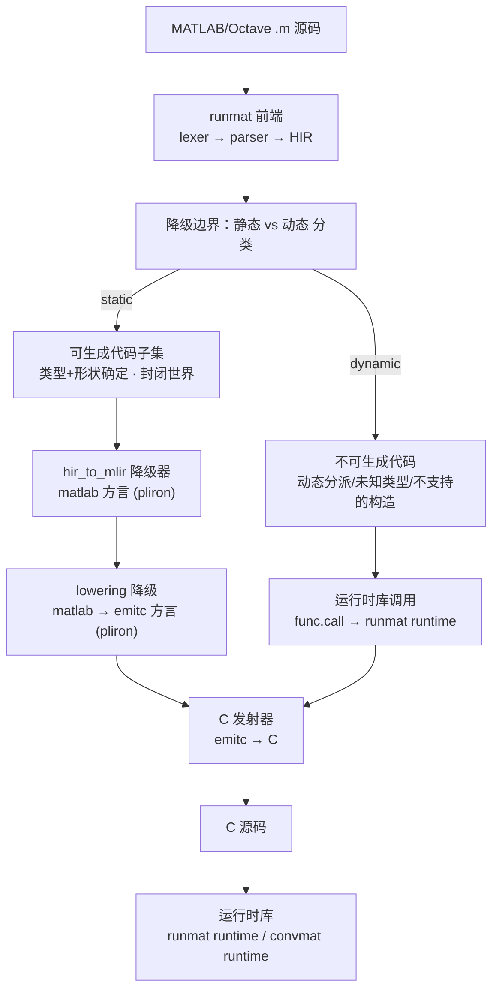

# convmat 架构

> 本文档是 convmat 的权威架构说明。做任何涉及前端/后端/方言/代码生成的改动前，
> 先对照本文，避免偏离既定设计。Agent 的工作约定与工程规范见 `AGENTS.md`。

## 1. 目标与非目标

**目标**：成为「更好的 MATLAB Coder」——把 MATLAB/Octave 源码编译成可部署的
本地代码，优先是 C，同时为其他后端预留清晰接口。

**非目标（至少当前阶段）**：

- 不追求 100% 覆盖 MATLAB 语言；允许一个「可生成代码子集」+ 运行时兜底。
- 不重复实现词法/语法解析、类型/形状推断、名字解析等前端工作（复用 runmat）。
- 不依赖 C++ 的 MLIR/LLVM 工具链（libMLIR、mlir-translate、mlir-opt）；IR 骨架用
  **pliron**（纯 Rust 的 MLIR 式框架），优化暂缓，C 发射器自写。

## 2. 核心决策一览

| 问题 | 决策 |
|------|------|
| 从哪一层进入 IR | **HIR → `matlab` 方言 → `emitc` 方言 → C**（不是 AST，也不是 MIR） |
| 可/不可生成代码的边界 | 静态分析后按「类型/形状是否确定 + 是否封闭世界」做函数级/表达式级分类 |
| 代码生成后端 | 今天 `emitc` 方言 → C 发射器；LLVM/GPU 预留（LLVM 可走「发 C 让 clang 转」） |
| 函数 ABI（跨函数传值） | 能由 C 直接表示的值走返回值；数组/可变长等走**输出指针入参**，空间由调用方分配 |
| 可变参数（varargin/varargout） | 封闭世界内按调用点特化（`nargin`/`nargout` 常量折叠）；开放世界降为运行时 cell + `Value` 盒 |
| 编译期/运行期值分级 | 类型/形状编译期已定的走 `matlab` 方言（静态数组）；运行期才定的走运行时 + 形状描述符 |
| 内存管理 | 静态局部走栈（`matlab.alloca` → C 局部数组）、跨函数走调用方分配的输出指针、动态/增长走运行时堆 |
| 数组/矩阵值模型 | `Shape::Static`（列主序 `matlab.array`）与 `Shape::Dynamic`（形状描述符） |
| 内建函数降级 | 纯数值内建 → C `libm` 的 `matlab.call` 或内联 pattern；有副作用/形状未知的 → 运行时兔底 |
| 是否自定义方言 | **定义两个 pliron 方言**：`matlab`（语义）与 `emitc`（C 级），之间用 pliron pass 降级 |
| 优化 | 暂不做（不接 canonicalize/CSE/linalg）；优先「生成正确的 C」，后续按需补 |

## 3. 决策一：从 HIR 降级（而非 AST 或 MIR）

选择 **HIR → IR**，理由：

1. **语义鸿沟最小**。IR 是静态类型、SSA、值语义的底层表示；MATLAB AST 是动态
   类型、隐式广播、矩阵优先、重载操作符的高层表示，二者距离太大。直接从 AST 降级，
   等于要在 convmat 里重写一遍「类型推断 + 形状推断 + 名字解析 + 控制流归一化 +
   确定赋值分析」这套 runmat 已经实现且仍在维护的机器。
2. **复用而非重造**。runmat 前端管线是 `lexer → parser → HIR → MIR`。HIR 是这套管线里
   **名字已解析、操作符已脱糖、仍是结构化语句**的一层——`if`/`while`/`for`/`switch`
   还是结构化节点（不需要从 CFG 恢复），而 MIR 已经把控制流拍平成基本块 + 终止符。
   在 HIR 处接入，既省掉 CFG 恢复，又白捡了整个前端的名字解析与脱糖。
3. **MIR 作为备选不划算**。MIR 的 CFG 与扁平化 SSA 表示（`MirLocalId`/`MirRvalue`/
   `MirTerminator`）对「生成 C」而言是过度归一化：convmat 反而要再写一遍结构化控制流
   恢复（支配树/回边检测）才能得到 `if`/`while`/`for`。直接从 HIR 走更直接。

> 结论：**runmat 前端（lexer/parser/HIR）是 convmat 的第 0 层，HIR 是 convmat
> 的输入边界**。convmat 自己的起点是「HIR → `matlab` 方言降级器」。

对应 crates（均已发布到 crates.io，0.6.2）：

- `runmat-parser`、`runmat-hir`

> 注意：runmat 目前是 pre-1.0，HIR 语义仍在演化。降级器应集中在一处（见 §8
> `hir_to_mlir` 模块），把对 HIR 结构的依赖隔离起来，便于跟随 runmat 版本升级。

## 4. 决策二：可生成代码 / 不可生成代码的边界

MATLAB 是动态语言，无法（也不应）要求所有代码都静态可编译。边界由**静态分析结果**
决定，且是**函数级 + 表达式级**的，而不是「要么全编译、要么全解释」。

**判定规则**：一个函数（或子表达式）「可生成代码」当且仅当同时满足：

1. **类型确定**：所有变量的元素类型被推断为具体类型（`double` / `single` / `int32` /
   `logical` 等），而非动态 `Value` 盒。
2. **形状可控**：需要静态形状的地方（例如进入数组的数组）形状已推断；
   形状运行期才确定的，降级为运行时库调用。
3. **封闭世界**：被调用的函数要么同样可生成代码，要么被声明为外部符号（映射到运行时
   C 函数）。`varargin`/`varargout` 只有在封闭世界内、且所有调用点已知时才能静态化
   （按调用点特化，见 §12）；开放世界则降为动态。
4. **不含不支持的构造**：如 `eval`/`evalin`、字符串形式的 `feval`、`assignin`、动态
   字段/元胞索引、cell 字面量（`{...}`）、`classdef` 动态分派、`try`/`catch`、多返回值调用
   （`[a,b]=f()`）、参数展开（`{:}`）、逻辑下标（`A(mask)`）等。`break`/`continue`、
   `persistent`、已知类型的 `global`（编译为 C `static`）、以及标量字段的 `struct`
   （构造/字段读写/按值传参与返回）已支持。

**边界两侧的处理**：

- **边界内（可生成代码）**：HIR 节点 → `matlab` 方言 → `emitc` 方言 → C。
- **边界外（不可生成代码）**：不报错中止，而是**降级为运行时库调用**
  （`func.call` 到 runmat runtime / convmat runtime 的 C 符号），把该表达式/函数交给
  运行时解释执行。这样生成的 C 是「静态编译代码 + 少量运行时回退调用」的混合体。

> 这与 MATLAB Coder 的「code generation readiness + `coder.extrinsic`」思路一致，
> 但边界由 convmat 自己的静态分析统一判定，而不是要求用户手工标注。

## 5. 决策三：代码生成后端（今天 C，预留其他）

后端做成**可插拔策略**，输入都是同一个「已降到 `emitc` 方言」的 pliron IR：

- **今天**：`emitc` 方言 → **自写 C 发射器**（`src/emit_c.rs`），产出 C++ 风格源码
  （`double`/`void`/`std::tuple` 返回值、`bool`、`for`/`if`/`while`）。不再依赖
  `mlir-translate --mlir-to-cpp`。
- **预留**：同一 IR 可换 LLVM 后端（直接把 C 交给 clang，或写 pliron-llvm 发射器）、
  GPU 等。换后端只改「后端选择」这一层，不动前端和降级器。

**函数 ABI**：生成的 C 函数遵循「C 能直接表示的值走返回值，不能的走输出指针」的统一约定：

- 标量（`double`/`int32`/`logical` 等）以及固定数量的多标量返回值，走函数返回值；
  多返回值用 `std::tuple` 表达（见 `tests/fixtures/polar.m`）。
- **struct**（`matlab.struct`，字段为标量的固定布局）可以按值传参与返回：形参是
  `struct s0 v1`，返回是 `struct s0 f()`（多出参里与标量一起进 `std::tuple`）。字段
  布局由 `hir_to_mlir` 定义在文件作用域（所有函数之前）。struct 类型在 C 里可直接表示，
  故走值语义，与 MATLAB 值类一致。
- 数组、矩阵、字符串，以及任何 C 类型无法直接表示（或大小运行期才确定）的值，
  **不作为返回值**，而是作为**额外的输出指针入参**；缓冲空间由**调用方**分配——
  被调方只写不分配，调用方在调用前预留好空间。这相当于 C ABI 里的 sret 手法，把
  「谁分配、谁释放」的所有权固定在调用方一侧，避免数组返回值的所有权歧义。
- 该约定在 `hir_to_mlir` 产出的 `builtin.func` 签名里表达（数组输出 → 输出指针入参），
  `lowering` 阶段解析 ABI，`emit_c` 阶段落实成 C 签名。

**运行时组件**：生成的代码链接一个运行时库（runmat runtime 或一个薄薄的 convmat
runtime shim），负责内存管理、动态类型盒、内置函数、以及 §4 里边界外的兜底语义。
动态 tier 的统一值模型（`convmat_value`）、形状描述符、内存管理、运行时 ABI 与
静态↔动态桥接见 `docs/runtime.md`。

## 6. 决策四：自定义方言

**结论：定义两个 pliron 方言——`matlab` 与 `emitc`。**

理由（与早期「只用核心方言」决策的差异）：

1. **pliron 没有标准方言**。melior/MLIR 提供 `arith`/`scf`/`memref`/`func`/`emitc` 等
   现成方言及其转换 pass；pliron 只提供 IR 骨架（SSA/region/block/dialect/op/type/
   pass 框架），没有这些标准方言。要表达 MATLAB 语义，必须自建方言。
2. **两个方言、一次降级**：`matlab` 承载「程序是什么意思」（数组、逐元素、矩阵乘、
   转置、归约、比较、控制流、`libm` 调用），`emitc` 承载「C 如何表达」（声明、赋值、
   三元、调用、`if`/`while`/`for`/`break`/`return`，以及顶层 `#include`/`#define` 等指令）。
   二者之间用 pliron 的 pass 框架做一次结构化降级（`src/lowering.rs`），把语义与 C
   表示分开，便于测试与演进。
3. **容器复用 builtin**：`module`/`func` 一律用 pliron 内置的
   `builtin::ModuleOp`/`builtin::FuncOp`（`matlab` 与 `emitc` 两侧都是），不重复定义
   `emitc.func`/`emitc.module`。自建方言只覆盖 builtin 表达不了的 body op 与顶层指令。
4. **不追求语法完整**。方言只覆盖当前可生成代码子集需要的 op；`linalg` 级融合/向量化
   等优化**暂不引入**（优化延后）。

> **高阶语义如何降级**：HIR 降级器直接展开到 `matlab` 方言（矩阵乘/转置/归约在编译期
> 展开为循环 + `load`/`store`），`lowering` 把 `matlab` 逐 op 重写为 `emitc`，`emit_c`
> 做最后 1:1 的 C 打印。三个模块职责单一，各自可测。

## 7. 架构图与编译管线

### 7.1 高层架构图



### 7.2 端到端编译管线（输入 → 调用 → 产出）

下面是一条命令 `convmat add.m`（`pipeline::compile`）从源码到 C 的完整链路：

| 阶段 | 模块 / 函数 | 输入 | 调用（复用/自研） | 产出 / 效果 |
|------|-------------|------|--------------------|-------------|
| 0 前端 | `src/frontend::parse_hir` | `.m` 源文本 | `runmat_parser::parse` → `runmat_hir::lower` | `HirAssembly`（lexer→parser→HIR，名字已解析、操作符已脱糖） |
| 1 边界 | `src/triage::classify` | `HirAssembly` 的每个 `HirFunction` | 自研白名单 + `infer_locals`（形状推断，区分 `Static`/`Dynamic`） | `Static`（可生成）或 `Deferred`（降运行时，MVP 报错） |
| 2 降级 | `src/hir_to_mlir::lower_to_module` | 可生成代码的 `HirFunction` | pliron + `matlab` 方言 + `builtins` 表（`matlab.call @libm`） | `matlab` 方言 module（含数组/矩阵/内建/控制流） |
| 3 降级 | `src/lowering::lower_module` | `matlab` 方言 module（builtin 容器） | 自研 pass（pliron 框架） | builtin module：`builtin.func`（body 为 `emitc.*` op）+ 顶层指令；ABI 已解析、数组已命名 |
| 4 发射 | `src/emit_c::emit` | builtin module（`builtin.func` + `emitc.*`） | 自写 pretty-printer | C 源码文本（最终产物） |
| 5 运行时兔底（分支） | `src/runtime::defer_to_runtime` | 被 `Deferred` 的函数（从阶段 1 分支） | 运行时 shim（MVP 尚未实现，当前报错） | 运行时调用（预留） |

```text
.m 源码
  └─[0 前端 runmat]─────────────────────────────→ HirAssembly
  └─[1 边界 triage]── Static ────────────────┐   └─ Deferred → runtime（MVP 报错）
  └─[2 降级 hir_to_mlir]──────────────────────┤   → matlab 方言 module
  └─[3 降级 lowering]─────────────────────────┤   → builtin module（func + emitc.* op）
  └─[4 发射 emit_c]───────────────────────────┘   → C 源码
```

> **关键点**：
> - 边界（阶段 1）是「静态 vs 动态」的分水岭；只有 `Static` 才进入降级，`Deferred` 走
>   运行时兔底。
> - 内存分配决策（栈/堆/输出指针，§11.3）在阶段 2 降级时依据 `LocalTy` 做出。
> - 阶段 2 产出的 `matlab` 方言与后端无关，换后端只替换阶段 4（§5 可插拔策略）。
> - 阶段 2→3→4 都是纯 Rust、进程内完成，无外部工具调用、无文本 round-trip。

## 8. 分层与模块职责

| 层 | 模块（建议路径） | 职责 | 复用/自研 |
|----|------------------|------|-----------|
| 0 前端 | `runmat-parser/hir` | 解析、HIR | 复用 runmat |
| 1 输入 | `src/frontend/` | 读取 `.m`、驱动 runmat 前端、产出 HIR | 薄封装 |
| 2 边界 | `src/triage/` | 静态 vs 动态分类，产出「可生成代码计划」+ 形状推断（`Shape`/`LocalTy`） | 自研（核心） |
| 2.5 方言 | `src/dialects/matlab.rs` | `matlab` 方言（语义）：数组类型 + 标量/数组/控制流 op | 自研（核心） |
| 3 降级 | `src/hir_to_mlir/` | HIR → `matlab` 方言；动态部分 → 运行时调用；内存分配策略 | 自研（核心） |
| 3.5 内建表 | `src/builtins.rs` | 内建函数名 → 降级配方（`libm` 符号/归约/内联） | 自研（薄表） |
| 4 降级 | `src/lowering.rs` | `matlab` → `emitc` 方言（ABI 解析、数组命名、op 重写） | 自研（核心） |
| 4.5 方言 | `src/dialects/emitc.rs` | `emitc` 方言（C 级）：声明/赋值/三元/调用/控制流 body op + 顶层指令（`include`/`define`/`undef`/`verbatim`）；容器复用 builtin `module`/`func` | 自研（核心） |
| 5 后端 | `src/emit_c.rs` | `emitc` → C 源码（pretty-printer）；LLVM/GPU 预留 | 自研 |
| 6 运行时 | `runtime/`（或复用 runmat runtime） | 内存管理、动态盒、内置函数、兜底语义 | 复用 + 薄 shim |

## 9. 依赖与复用原则

- **依赖**：`runmat-*` 0.6.2（前端）、`pliron` 0.18（IR 骨架，纯 Rust）。
- **不依赖**：`melior`、`libMLIR`/`libMLIR-C`、`mlir-translate`、`mlir-opt`。构建是纯
  `cargo build`，无需本机安装 MLIR/LLVM。
- **不重复造轮子清单**：
  - 解析/名字解析 → 用 runmat，不自研。
  - IR 骨架（SSA/region/block/dialect/op/type/verifier/pass 框架）→ 用 pliron，不自研。
  - C 发射器、HIR→matlab 降级器、matlab→emitc 降级器、静态/动态分类（triage）→ 自研，
    这是 convmat 的独特价值。
- **明确不自研**：优化 pass（canonicalize/CSE/linalg 融合/向量化）——本期不做，后续
  需要时在 `matlab`/`emitc` 之间插 pliron pass 或直接交给后端。

## 10. 矩阵/数组支持与内建函数降级（现状与路线）

### 10.1 值模型

- **形状**：`Shape::{Static{rank, dims}, Dynamic}`，记录 MATLAB 逻辑维度（`dims[0]` 行、
  `dims[1]` 列、…），行向量 `1×N` 与列向量 `M×1` 被区分对待；`Dynamic` 对应动态形状
  tier（见 §11，P7 未实现）。
- **存储**：扁平 `matlab.array`（`numel = ∏dims`），线性顺序为 **MATLAB 列主序**。
  `runmat` 的 `Aggregate.elements` 是行主序，降级时在字面量边界做转置。
- **类型格**：`LocalTy::{Scalar, Array{shape}, Struct{fields}, Dynamic}`；元素类型暂只 `f64`
  （`logical` 以 `matlab.bool` 表示，比较/逻辑产生 `bool`，最终映射到 C++ `bool`）。
  `Struct` 的字段目前仅标量（数组/嵌套 struct 字段未做，见 §10.5）。
- 形状来源：静态分析只有字面量 + 形状传播（转置/乘/按维归约）；形参默认标量，
  数组形参需 `runmat-static-analysis`（见 §10.5）。struct 形参的字段布局从「字段访问
  使用点」（`s.a`、`s.a = ...`）推断，与 MATLAB Coder 的使用点结构推断一致。

### 10.2 运算符

全部二进制/一元/关系/逻辑运算符均已覆盖（`OperatorKind` 全量）：

- 逐元素（同形数组或标量广播）：`+ - .* ./ .\ .^` 及比较 `== < > ~= <= >=`、逻辑 `& |`。
- 幂：`.^`（逐元素 `pow`）；`^` 的标量形式 `a^b` 也是 `pow`，矩阵形式 `A^k`（方阵 +
  常量整数指数 `k ≥ 0`）走 `convmat_mpower`。
- 转置：`.'` / `'`（2-D 交换 `dims[0]`/`dims[1]`）。
- 矩阵乘：`*`（`m×k · k×n → m×n`）；矩阵/向量乘由同一条路径覆盖。
- `mrdivide`/`mldivide`（矩阵 `/` `\`）、数组×数组广播、N-D 转置 → 延后（标量 `/` `\` 已支持）。

### 10.2.1 降级策略：内联 vs 封装

运算符按「翻译到 C 时是否展开循环」分两类（见 `hir_to_mlir` 与 `src/runtime`）：

| 策略 | 适用 | 产物 |
|------|------|------|
| **内联（展开）** | 便宜、可 1:1 直译的：标量算术、逐元素 `+ - .* ./ .\ .^`、比较/逻辑、归约、`libm` 内建 | `for` 循环 / `matlab.binop` / `matlab.call @libm` |
| **封装（调用 runtime helper）** | 会「改变内存布局」或有算法复杂度的：转置、矩阵乘、矩阵幂 | `matlab.call_void` → `emitc.call_void` → `convmat_*` C 函数 |

- 封装的操作不再在编译期展开循环，而是发射对 `convmat_*` 运行时函数的单次调用，
  结果写入调用方分配的 out-buffer（延续 §5 ABI）。`>2` 维的形状变换（`permute`/`reshape`）
  与批量矩阵乘沿用同一封装思路，未实现时归入运行时兔底。
- 运行时函数库目前**按需内联**进生成的 C：`lowering` 扫描模块里实际引用的 `matlab.call_void`
  callee，只发射用到的 helper（`src/runtime::helper_source`），未知名字报错；后续可移到
  链接式 `convmat_runtime` 库（§5）。

### 10.3 内建函数降级

`src/builtins.rs` 维护「内建名 → 配方」薄表，`HirCall` 按配方降级：

- **一元逐元素**（标量/数组）：`sin cos tan asin acos atan sinh cosh tanh exp log log10
  log2 sqrt abs floor ceil round` → `matlab.call @libm`。
- **二元逐元素**（标量）：`pow atan2 hypot mod rem` → `matlab.call @libm`。
- **内联**：`sign`、`min`/`max`（两标量 → `fmin`/`fmax`）。
- **归约**：`sum prod min max`（一参 → 全归约到标量；二参 `(A, dim)` → 按维归约到
  行/列向量）。
- **形状内省**：`numel length size(A,dim) size(A)`。
- **构造器/重塑**：`zeros(m,n) ones(m,n) eye(n) reshape(A,m,n)`（维度须为常量）。
- 未支持/有副作用/形状未知的内建 → 运行时兔底（`Error::NotLowerable`）。

### 10.4 管线（优化延后）

```text
lower(HIR → matlab 方言)
  → lowering(matlab → emitc 方言)
  → emit_c(emitc → C)
```

**不做**：canonicalize / CSE / linalg 融合 / 向量化。生成代码是「正确但未优化」的 C
（每个 SSA 值一个临时变量、scalar cell 展开为裸 `double`）。后续优化可在
`matlab`/`emitc` 之间加 pliron pass。

### 10.5 路线状态

| 阶段 | 状态 | 说明 |
|------|------|------|
| P1 形状模型 | ✅ 完成 | `Shape`/`LocalTy`、列主序、行/列/N-D 元数据 |
| P2 逐元素/广播/转置/逻辑 | ✅ 完成 | 同形数组 + 标量广播 + 2-D 转置（封装 `convmat_transpose`） |
| P3 矩阵乘/幂 | ✅ 完成 | `*` 封装 `convmat_matmul`；`^`/`.^` 已支持（矩阵幂封装 `convmat_mpower`） |
| P4 内建 | 🟡 部分 | 归约(含按维)+形状内省+`zeros/ones/eye/reshape` 已做；`permute/repmat/cat/horzcat/vertcat` 未做 |
| P5 索引/冒号/`end` | 🟡 部分 | 常量下标 `A(i,j)`、线性 `A(i)`、`end`、`A(:)` 已做；`A(i,:)`/`A(:,j)`/冒号区间/变量下标/逻辑下标未做 |
| 控制流 | ✅ 完成 | `if`/`elseif`/`else`、`while`、`for`（升/降序，编译为方向感知的 C `for`）、`switch`、`break`/`continue`；`try`/`catch` 未做 |
| 存储类 | 🟡 部分 | 局部栈变量；`persistent`/`global` 编译为 C `static`（单函数封闭世界）；多返回值调用 `[a,b]=f()` 未做 |
| struct 类型 | 🟡 部分 | `struct('a',1,...)` 构造、`s.a` 读/写、struct 按值传参/返回（含多出参 tuple）、struct 形参字段使用点推断；数组/嵌套 struct 字段、struct 数组未做 |
| cell 类型 | ⛔ 未做 | cell 字面量 `{...}`、`c{i}` 花括号索引、`cell(...)` 构造均 defer（需运行时 cell ABI，见 §12）；`varargin`/`varargout` 的 cell 语义已通过封闭世界特化覆盖 |
| 内存调度 | ✅ 完成 | 静态数组按 `numel` 调度：小数组入栈、超过 `STACK_ELEMS_LIMIT`（默认 4096 元素）的大数组堆分配并在返回前 `delete[]`；动态形状堆分配未做（见 P7） |
| P6 优化 | ⛔ 未做 | 优化整体延后（无 canonicalize/CSE/linalg） |
| P7 动态形状 | ⛔ 未做 | 需 `runmat-static-analysis`（见下方依赖困难）；参数展开 `{:}`/逻辑下标等需运行时形状 |

> 数组形参目前被当作标量；`sum(param)` 等会被解释为标量恒等。这是无静态分析下的
> 已知限制，P7 接入静态分析后解决（动态形状走形状描述 ABI）。

**P7 依赖困难（已实测 `cargo add runmat-static-analysis`）**：

- 依赖链是 `runmat-static-analysis → runmat-vm → runmat-runtime`，`runmat-runtime`
  带原生依赖：
  - **HDF5**（`hdf5-metno-sys`）：本机无系统 HDF5，`cargo check` 立即失败。
  - **OpenBLAS**（`openblas-src`）：需要 Fortran 编译器从源码编译。
  - 另通过 `runmat-accelerate`（→ `wgpu`）引入 GPU 栈，以及 filesystem/plot/zip/zstd
    等大量间接依赖。
- 依赖成本与 convmat「薄编译器」目标冲突：为拿「类型/形状推断」却要编译整个 runmat
  解释器/运行时。
- `runmat-static-analysis` 是 pre-1.0，驱动入口 API 未文档化。

> 建议：优先自写一个聚焦数值子集的轻量类型/形状推断（扩展当前 `infer_locals`），
> 而非引入整个 VM 栈；或把静态分析做成 feature gate 并接受原生构建成本。

## 11. 值分级、动态形状与内存管理

### 11.1 编译期 vs 运行期值

把每个值分成两个 tier，由静态分析的结果决定（不是全局开关，而是**函数级 + 表达式级**）：

| Tier | 判定 | IR 表示 | 内存 |
|------|------|-----------|------|
| **静态值** | 类型/形状编译期已定（字面量、常量维度、形状传播） | `f64`/`bool`、`matlab.array` | 栈（`matlab.alloca` → C 局部数组）或调用方缓冲 |
| **动态值** | 类型/形状运行期才定（形参数组、动态形状、动态类型盒） | 形状描述符 + 数据指针 | 堆（运行时分配） |

- **编译器必须算出**的：每个值的类型/形状（或标记为动态）、函数 ABI 布局（哪些走返回值、
  哪些走输出指针、缓冲大小）、内存分配策略（栈/堆/输出指针）。
- **运行时才能算出**的：动态形状的实际维度、动态类型的真实类型、越界/重分配、以及
  §4 边界外语义的兔底。

> 这条是 §4「形状可控」的细化：静态值走 `matlab` 方言，动态值走运行时 + 形状描述符，
> 二者在同一个函数里可以共存（函数级/表达式级混合）。

### 11.2 动态形状

- `Shape::Static(dims)` → 静态 `matlab.array`（编译期已知，可入栈/调用方分配）。
- `Shape::Dynamic` → 维度运行期通过**形状描述符**传递。
- **动态形状 ABI**：输出走「数据指针 + 形状描述」两个入参（或一个 emxArray 风格的
  结构体：`data ptr + dims + capacity`），空间由调用方分配/释放；这也延续 §5「输出指针入参」
  的约定。

### 11.3 内存管理（谁分配、谁释放、放哪层）

三条规则，由值的 tier 决定：

1. **固定形状、不逃逸的局部值** → 栈局部数组（`matlab.alloca` → `double a[N]`），无需显式释放；
   **超过栈预算的大数组**（`numel > STACK_ELEMS_LIMIT`，默认 4096 元素 ≈ 32 KiB）→
   堆分配（`double* a = new double[N]`），返回前 `delete[]`。
2. **固定形状、跨函数传递的数组** → 调用方分配缓冲（栈或堆），输出指针入参（§5 ABI），
   所有权固定在调用方。
3. **动态形状/可能增长的值** → 堆分配，由运行时 shim 管理。

**栈/堆调度**：静态数组的内存位置由 `hir_to_mlir` 的分配策略决定（`alloc_on_heap`），
阈值是编译期常量 `STACK_ELEMS_LIMIT`。`persistent`/`global` 变量优先编译为 C `static`
（栈/静态存储），暂不参与堆调度；后续可让大尺寸的 `static` 数组也走堆 + 首次初始化。

**归属**：

- **分配决策**（栈 vs 堆 vs 输出指针）在 `hir_to_mlir`（第 3 层）做，依据 `triage` 的
  `LocalTy`（`Static`/`Dynamic`）与数组大小。
- **运行时堆分配器 + 形状描述符 + 越界/重分配** 在 `runtime/`（第 6 层）。

> 现状：静态 tier 已支持「栈 + 大数组堆分配」（`Shape::Static` 入栈/堆/输出指针）；
> 动态 tier 是 P7，受 `runmat-static-analysis` 依赖阻碍（见 §10.5）。动态 tier 的
> 运行时库设计（值模型/形状描述符/内存/ABI/桥接）已整合到 `docs/runtime.md`。

## 12. 可变参数 varargin / varargout

### 12.1 本质：可变元数 + 异构类型

- `varargin` 在 MATLAB 里是 cell 数组，元素个数与元素类型都运行期才定；`varargout`
  同理，输出个数运行期才定。
- 因此 varargin/varargout **本质属于动态 tier**（§11.1）：类型未知、形状未知、个数未知。

### 12.2 封闭世界 → 编译期特化（静态路径）

当程序封闭（所有调用点已知，§4「封闭世界」），编译器可以把可变元数「特化」掉：

- `nargin`/`nargout` 在每个调用点常量折叠为实际传入/接收的个数。
- `varargin{k}`（`k` 为常量）解析为调用点的第 `k` 个实参，直接引用，而不是 cell 访问。
- 函数按「不同的实参个数/类型」monomorphize 成若干固定签名版本（类似 C++ 模板实例化）。

> 这与 MATLAB Coder 的思路一致：varargin/varargout 需要「封闭世界 + 所有调用点已知」
> 才能生成代码。

### 12.3 开放世界 → 运行时（动态路径）

当无法封闭（外部调用者、递归、函数句柄传递、`feval`），varargin/varargout 降为动态
运行时语义：

- **输入 ABI**：`func(int nargin, Value* args, ...)`，每个 `Value` 是动态类型盒。
- **输出 ABI**：`func(..., int* nargout, Value** outputs)`。
- 这条路径走运行时库（`runtime/` 第 6 层），是 §4 边界外的语义兔底；具体类型盒
  （`convmat_value`）与运行时 ABI（`convmat_runtime_fn`）见 `docs/runtime.md` §2、§5。

### 12.4 与 ABI（§5）和值分级（§11）的关系

- **特化后的固定签名**：沿用 §5 规则——标量走返回值，数组/可变长走输出指针入参。
- **动态 varargin 的参数**：无法用静态数组表达，改用 `Value` 盒 + 形状描述符
  （§11.2），所有权规则同 §11.3（动态值走运行时堆）。

### 12.5 当前状态与建议

- **已实现（封闭世界固定元数特化）**：
  - `nargin`/`nargout` 常量折叠为 `named + varargin/varargout 计数`；
  - `varargin{k}`（`k` 为常量）解析为第 `k` 个额外标量入参，不物化 cell；
  - `varargout{k} = expr`（`k` 为常量、`expr` 标量）解析为第 `k` 个额外标量出参（并入返回值 tuple）。
  - 可变元数由「函数体实际引用的最大常量下标」确定（`triage::Variadics`），这与
    MATLAB Coder 的「按调用点特化到固定元数」一致。
- **仍 defer**：`varargin{k}` 变量下标、`varargout{k}` 赋数组、`varargin{:}` 展开、
  运行时元数（开放世界）——这些需要运行时 cell ABI（§12.3）。
- 建议下一步：按需支持「多组不同元数」的 monomorphize（每个调用点一个固定签名），
  以及数组形参的 varargin/varargout。
